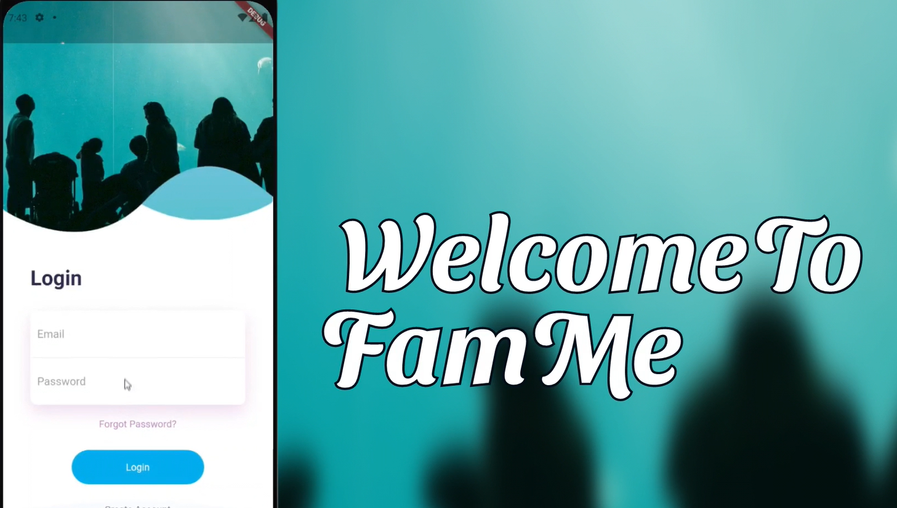
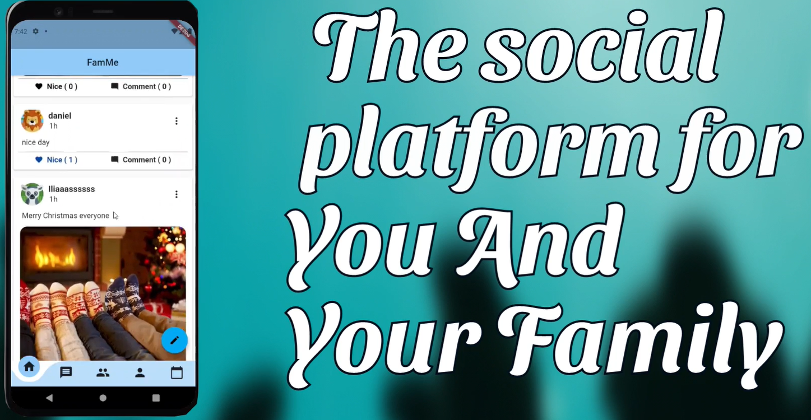
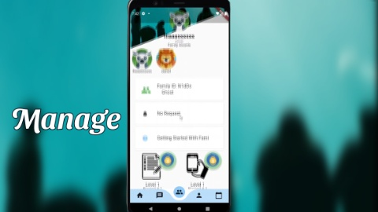
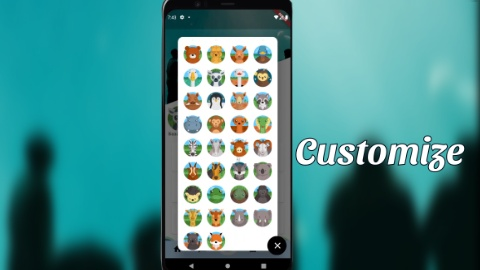
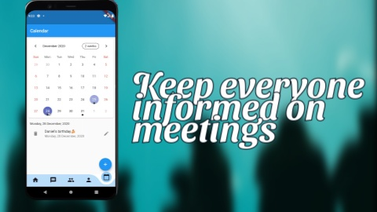

# flutter_familly_app

Technologies/languages:   
-Dart  
-Flutter  
-Google Firebase
-agora_rtc_engine for video calling  
 
Featurelist:
- Login/register in the firebase
- A homefeed where you can see the comments of your familygroup
- A one-to-one comunication tool where you can chat with you family members and makes (video)calls
- A profile page where the user can see his/her credantials based on the informations given in on the flutter application
  -> you can accept new family members
  -> there is a faq pag where you can write your questions(for all users)
  -> you can log out
  -> you can delete a user 
- A event page where you can make and plan events
- A calender page where you can plan meeting and events

Credits:
 Devogelaere Cédric, Boutechdat Iliass, Mahouti Yassin and ANANI Komi Daniel
